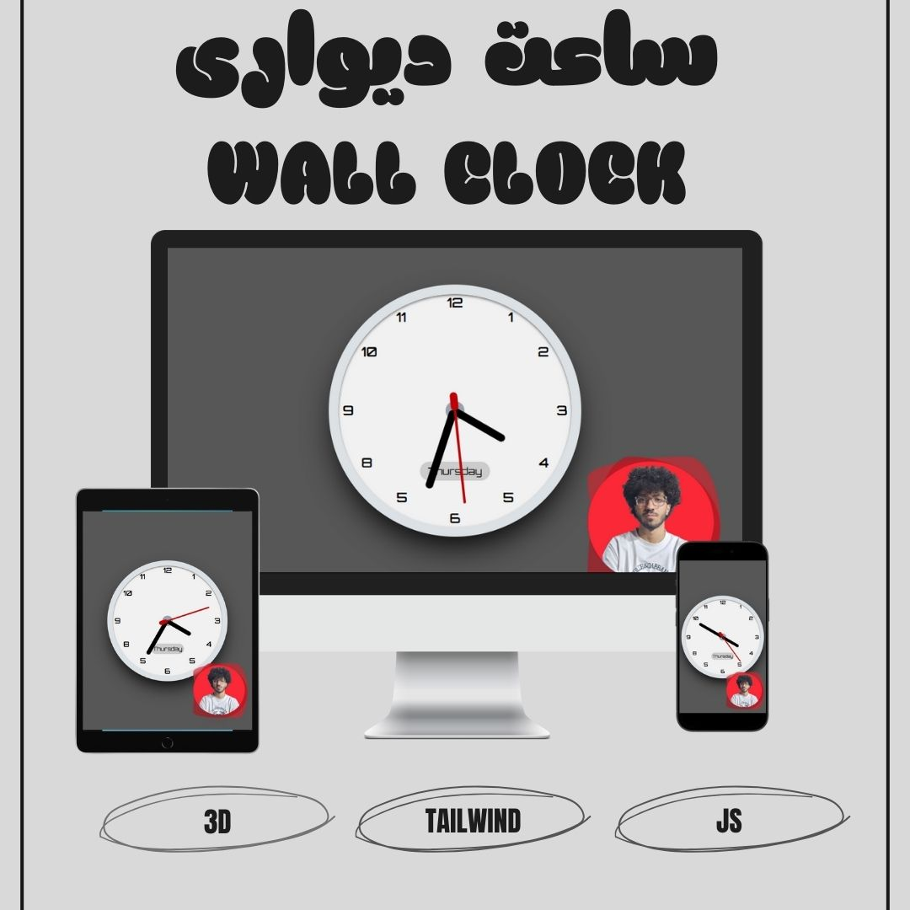
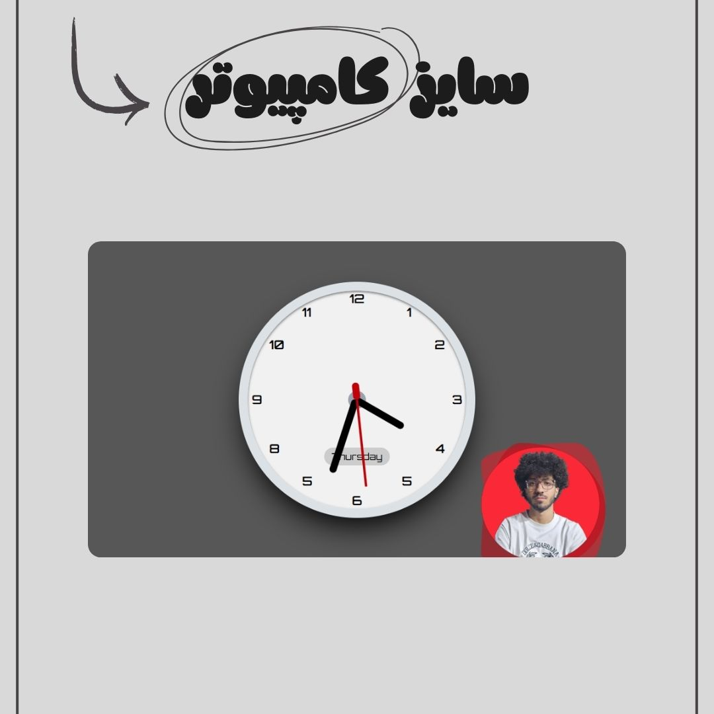
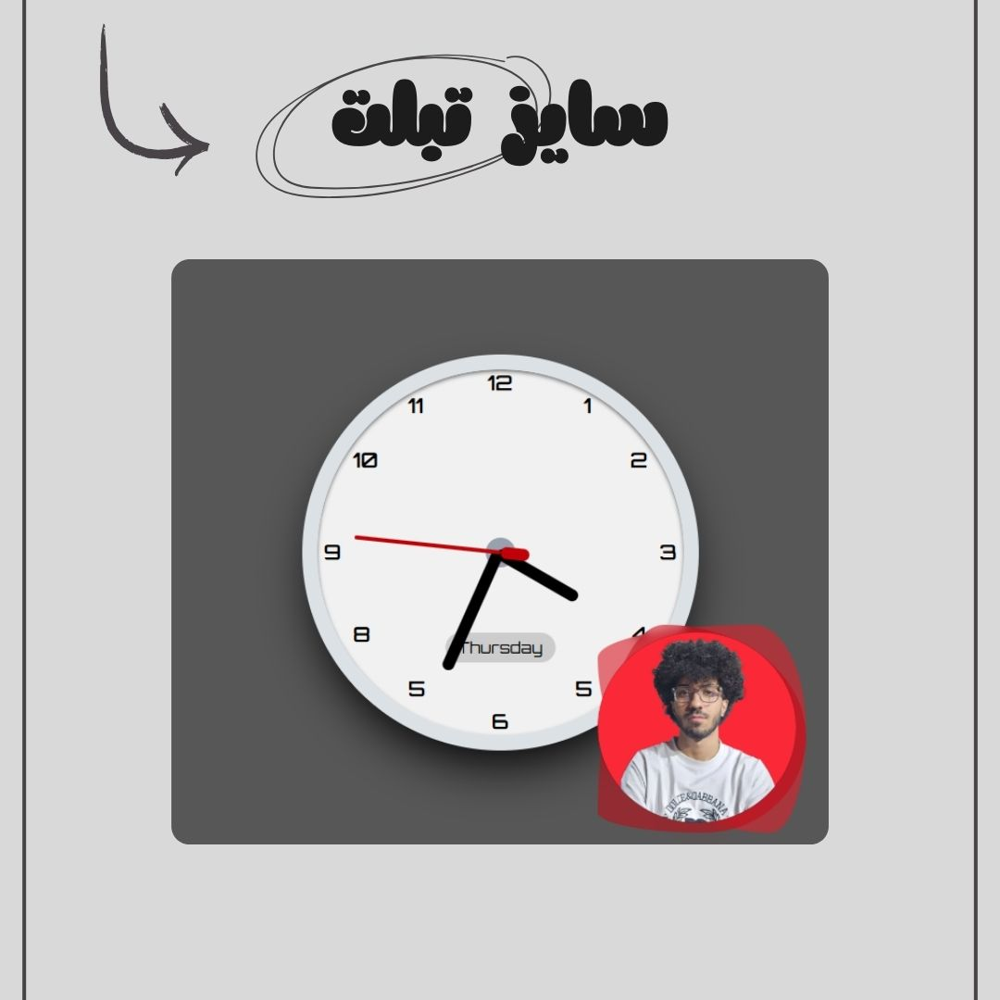

# 🕒 3D Analog Clock  

A fully functional **3D analog wall clock** built with **HTML, CSS, Tailwind CSS, and JavaScript**.  
The clock simulates real-time ticking hands for **seconds, minutes, and hours**.  
It also dynamically displays the **current weekday** at the bottom of the clock.  

---

## ✨ Features
- 🎯 **Real-time clock** with smoothly moving hands  
- ⏱️ **Second & minute hands** rotate **6 degrees per unit** (360° ÷ 60)  
- 🕰️ **Hour hand** rotates **30 degrees per unit** (360° ÷ 12)  
- 📅 **Dynamic weekday display** under the clock  
- 🎨 **Responsive & modern UI** built with Tailwind CSS  
- ⚡ **Pure JavaScript logic** to handle calculations and live updates  

---

## 📅 Project Date  
**August 19, 2025**

---

## 🛠️ Tech Stack
- **HTML5** – Structure & markup  
- **CSS3** – Styling & custom animations  
- **Tailwind CSS** – Utility-first responsive design  
- **JavaScript** – Clock logic & interactivity  

---

## 👨‍💻 Developed By  
**Parsa Dehghan Pour Farashah**

## 🔧 Project Mentor  
[@parsa_ghorbanian_web](https://www.instagram.com/parsa_ghorbanian_web)

---

## 🔗 Live Demo  
👉 [Check Live Clock](https://parsa-farshah.github.io/Real-Clock/)

---

## 📸 Project Screenshots  

### 💻 Preview  

### 💻 Desktop View  

### 📱 Tablet View  

### 📱 Mobile View  

---

## 📬 Contact Me
- 📸 Instagram: [@parsa_dehghanpour_dv](https://www.instagram.com/parsa_dehghanpour_dv)  
- 💼 LinkedIn: [Parsa Dehghan Pour Farashah](https://linkedin.com/in/parsa-dehghan-pour-farashah-85ab04250)  
- 💻 GitHub: [parsa-farshah](https://github.com/parsa-farshah)  
- 📩 Email: parsafarashah2002@gmail.com  
- 📺 YouTube: [@FrontEndFresh](https://youtube.com/@frontendfresh)  

---

> 💡 **Logic Explanation:**  
> - Second & minute hands: **6° per tick** (360° ÷ 60).  
> - Hour hand: **30° per tick** (360° ÷ 12).  
> - Current **weekday** is shown at the bottom dynamically.  
